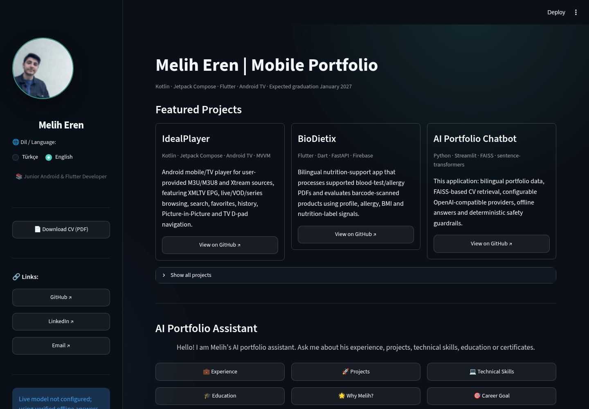
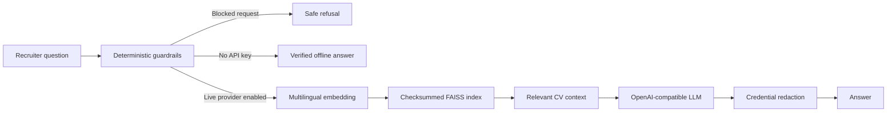

# Melih Eren | AI Portfolio

[](https://github.com/meliherenn/melih-eren-ai/actions/workflows/ci.yml)
[](runtime.txt)
[](https://streamlit.io/)
[](LICENSE)

A bilingual, recruiter-focused portfolio for **Melih Eren**, a Junior Android & Flutter Developer and
Software Engineering student graduating in **January 2027**. The app combines a polished Streamlit UI,
verified portfolio data, local CV retrieval and a safe offline fallback.

> Deployment note: the current [Streamlit deployment](https://melih-eren-ai.streamlit.app/) redirects to
> viewer authentication. Make the app public in Streamlit sharing settings before sending it to recruiters.



## What makes this project different

| Capability | Implementation |
| --- | --- |
| Recruiter-ready portfolio | Featured mobile projects, verified links, concise experience and one-page Turkish/English CV downloads |
| Bilingual experience | Complete Turkish and English UI, data, quick actions and retrieval metadata |
| Local RAG | Multilingual sentence-transformer embeddings with a direct FAISS cosine-similarity index |
| Safe offline mode | Useful deterministic answers without an API key, network call or invented portfolio fact |
| Provider flexibility | Cerebras, Groq, Gemini or another HTTPS OpenAI-compatible endpoint |
| Defense in depth | Input limits, secret redaction, common prompt-injection checks, output redaction and per-session live-request limits |
| Verified artifacts | Schema-validated JSON, one-page CV checks and checksummed FAISS/JSON retrieval files |
| Automated quality | Ruff, pytest, artifact validation, dependency updates and GitHub Actions CI |

## Architecture



Retrieval metadata is stored as JSON. The application does **not** deserialize Python pickle files.

## Run locally

Python 3.11 is recommended and pinned for deployment.

```bash
git clone https://github.com/meliherenn/melih-eren-ai.git
cd melih-eren-ai

python -m venv .venv
source .venv/bin/activate
python -m pip install --upgrade pip
python -m pip install -r requirements.txt

streamlit run app.py
```

No secret is required for the offline portfolio. To enable live AI answers:

```bash
cp .streamlit/secrets.toml.example .streamlit/secrets.toml
```

Then add a provider key to the local file:

```toml
LLM_PROVIDER = "cerebras"
LLM_MODEL = "gpt-oss-120b"
CEREBRAS_API_KEY = "your-key"
```

The secrets file is ignored by Git.

## Configuration

| Setting | Default | Purpose |
| --- | --- | --- |
| `LLM_PROVIDER` | `cerebras` | Provider preset: `cerebras`, `groq` or `gemini` |
| `LLM_MODEL` | Provider default | Model ID sent to the configured provider |
| `LLM_BASE_URL` | Provider endpoint | Optional OpenAI-compatible HTTPS endpoint; HTTP is accepted only for localhost |
| `LLM_API_KEY` | unset | Generic provider key; provider-specific keys are also supported |
| `MAX_INPUT_CHARS` | `1200` | Maximum normalized user-input length |
| `MAX_LIVE_REQUESTS_PER_SESSION` | `20` | Per-session live-model request budget before offline fallback |
| `ENABLE_ADMIN_PANEL` | `false` | Enables the editor only when a password is also configured |
| `ADMIN_PASSWORD` | unset | Password for the optional trusted-deployment editor |

See [.streamlit/secrets.toml.example](.streamlit/secrets.toml.example) and
[.env.example](.env.example) for complete examples.

## Rebuild retrieval artifacts

Run this whenever `data.json` or either CV changes:

```bash
python build_vector_db.py
python scripts/validate_project.py
```

The build reads both one-page CVs and structured bilingual data, creates normalized multilingual embeddings,
writes a FAISS index plus JSON metadata, and records SHA-256 checksums.

## Quality checks

```bash
python -m pip install -r requirements-dev.txt
ruff check .
ruff format --check .
pytest
python scripts/validate_project.py
python -m py_compile app.py build_vector_db.py guardrails.py portfolio_core.py scripts/validate_project.py
```

CI runs the same checks on every push and pull request.

## Project layout

```text
.
├── app.py                         # Streamlit interface and provider orchestration
├── portfolio_core.py              # Validation, safe URLs and artifact integrity
├── guardrails.py                  # Input policy, redaction and offline answers
├── build_vector_db.py             # Pickle-free multilingual FAISS build
├── data.json                      # Verified Turkish and English portfolio data
├── faiss_index/
│   ├── index.faiss
│   ├── documents.json
│   └── checksums.json
├── Melih_Eren_ATS_CV.pdf          # English one-page ATS CV
├── Melih_Eren_cvtr.pdf            # Turkish one-page ATS CV
├── scripts/validate_project.py
├── tests/
└── .github/
    ├── workflows/ci.yml
    └── dependabot.yml
```

## Security

Please read [SECURITY.md](SECURITY.md) before deploying. Never commit `.env`,
`.streamlit/secrets.toml`, API keys or admin passwords. The admin editor is intentionally disabled on public
deployments unless both its feature flag and password are set.

## Author

**Melih Eren** — Junior Android & Flutter Developer<br>
[GitHub](https://github.com/meliherenn) ·
[LinkedIn](https://www.linkedin.com/in/meliheren/) ·
[Email](mailto:meliheren2834@gmail.com)

## License

[MIT](LICENSE)
